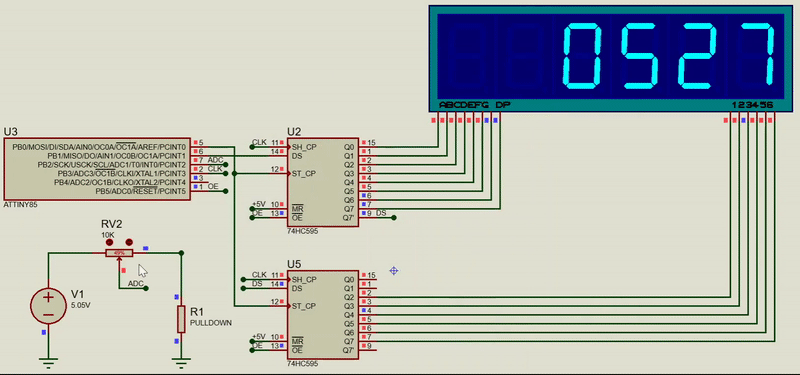

# ADC on the ATtiny85

Reading pin PB2 and displaying the output of the 10-bit ADC on a 7 segment display.

I've used two [74HC595](http://www.ti.com/lit/ds/symlink/sn74hc595.pdf) 8-bit shift registers to send data to the display.

# Proteus Simulation

- Use the [Proteus](https://www.labcenter.com/simulation/) file to simulate what has been described without using actual hardware.

# Demo 

